## Introduction  

### Who am I?  

#### **Mr. (almost Dr.!) Richard E.W. Berl**  
<big>(but "Ricky" is fine)</big>  

<big>_I am an evolutionary social (data) scientist with a background in behavior and cultural change and a passion for conserving biocultural diversity and improving social good and environmental sustainability._</big>

<br>

#### **B.A. Biological Sciences & B.A. Anthropology from [University of Delaware](https://www.udel.edu/) (2009)**  

{width="560"}  

<br><br>

#### **Field Assistant, [Lomas Barbudal Monkey Project](http://www.sscnet.ucla.edu/anthro/faculty/sperry/) (2009-2010)**  

* Lomas Barbudal Biological Reserve, Guanacaste, Costa Rica  

    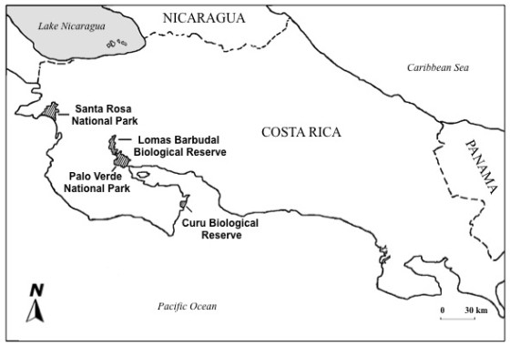{width="560"}  
    * Source: [UCLA Anthropology Lomas Barbudal Monkey Project](https://lbmp.anthro.ucla.edu/)  

    &nbsp;  
    
    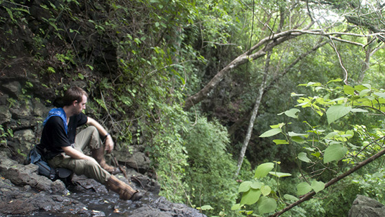{width="560"}  

<br>

* Social learning and behavioral traditions  

    <iframe width="560" height="315" src="https://www.youtube-nocookie.com/embed/Q74BB7aJWH0?rel=0" frameborder="0" allow="accelerometer; autoplay; encrypted-media; gyroscope; picture-in-picture" allowfullscreen></iframe>

<br>

* Short documentary: _Family Trees_ by [Prehensile Productions](http://www.prehensileproductions.com/)  

    <iframe width="560" height="315" src="https://www.youtube-nocookie.com/embed/pmDqI4s1VXY?rel=0" frameborder="0" allow="accelerometer; autoplay; encrypted-media; gyroscope; picture-in-picture" allowfullscreen></iframe>

<br><br>

#### **M.S. Zoology from [Washington State University](https://wsu.edu/) (2015)**  

* Social behavior and learning in captive gray wolves (_[Canis lupus](https://eol.org/pages/328607)_) at [Wolf Park](http://wolfpark.org/) in Battle Ground, IN  

    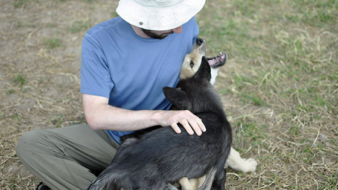{width="560"}  
<!-- end of list -->

    <iframe width="560" height="315" src="https://www.youtube-nocookie.com/embed/MHat4rzkkv8?rel=0" frameborder="0" allow="accelerometer; autoplay; encrypted-media; gyroscope; picture-in-picture" allowfullscreen></iframe>
        
    <iframe width="560" height="315" src="https://www.youtube-nocookie.com/embed/8Xqf42JD1Mo?rel=0" frameborder="0" allow="accelerometer; autoplay; encrypted-media; gyroscope; picture-in-picture" allowfullscreen></iframe>
    
<br>

* Social behavior in wild gray wolves (_[Canis lupus](https://eol.org/pages/328607)_) in [Yellowstone National Park](https://www.nps.gov/yell/learn/nature/wolves.htm)  

    <iframe width="560" height="315" src="https://www.youtube-nocookie.com/embed/gaXEDcMypBA?rel=0" frameborder="0" allow="accelerometer; autoplay; encrypted-media; gyroscope; picture-in-picture" allowfullscreen></iframe>
        
<br>

* Overimitation in non-Western Central African societies  

    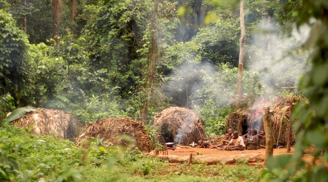{width="560"}  
    * Source: [Washington State University, Vancouver, Department of Anthropology](https://anthro.vancouver.wsu.edu/people/hewlett/bagandou-central-african-republic/)  
    
    &nbsp;  

    * **Berl, R.E.W.** & Hewlett, B.S. 2015. Cultural variation in the use of overimitation by the Aka and Ngandu of the Congo Basin. PLOS ONE 10(3): e0120180. doi: [10.1371/journal.pone.0120180](https://journals.plos.org/plosone/article?id=10.1371/journal.pone.0120180)

        **Number of irrelevant actions by group and demonstration condition.**  

        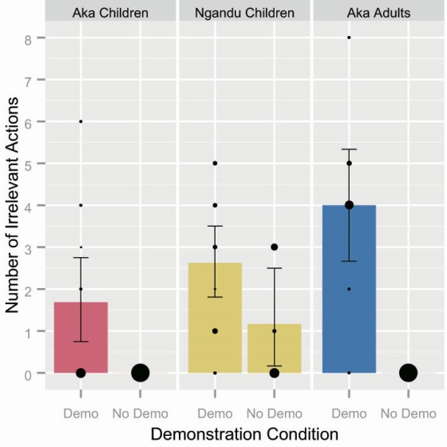{width="560"}  

<br>

* Cultural and genetic variation of the Chabu hunter-gatherers of Southwestern Ethiopia  

    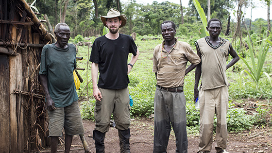{width="560"}  

    &nbsp;  

    * Gopalan, S., **Berl, R. E. W.**, Belbin, G., Gignoux, C., Feldman, M. W., Hewlett, B. S., & Henn, B. M. (2019). Hunter-gatherer genomes reveal diverse demographic trajectories following the rise of farming in East Africa [preprint]. bioRxiv, 517730. Available: https://www.biorxiv.org/node/152746.abstract  

        **Global ancestry proportions of northeast African individuals.**  

        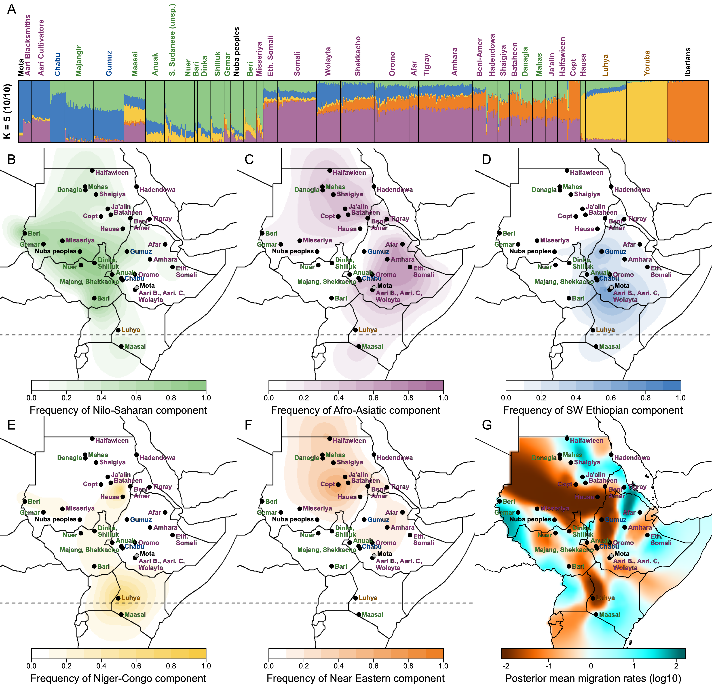{width="808"}  

        &nbsp;  

        **Effective migration surfaces depicted as contour lines over A) satellite imagery, B) elevation and water features, and C) the geographic distribution of major language families in Eastern Africa.**  

        {height="315"}  

<br><br>

#### **Ph.D. Human Dimensions of Natural Resources from [Colorado State University](https://www.colostate.edu/) (2019)**  

* Ph.D. Candidate in [Human Dimensions of Natural Resources](https://warnercnr.colostate.edu/hdnr/) (defending on May 15th!)

* [Graduate Certificate in Applied Statistics](http://statistics.colostate.edu/graduate-certificate-in-theory-applications-of-regression-models/)

* Influence of **_prestige_** in determining what people learn and from whom they choose to learn

    &nbsp;  

    **Prestige domain item loadings from exploratory factor analysis of attitudinal data.**  

    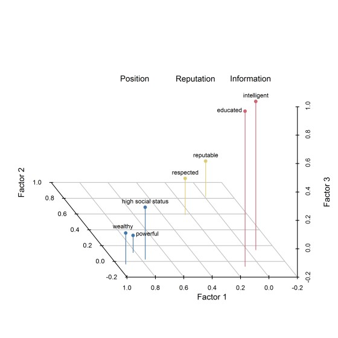{width="560"}  

    &nbsp;  

    **Determinants of prestige by level of social stratification across 16 societies.**  

    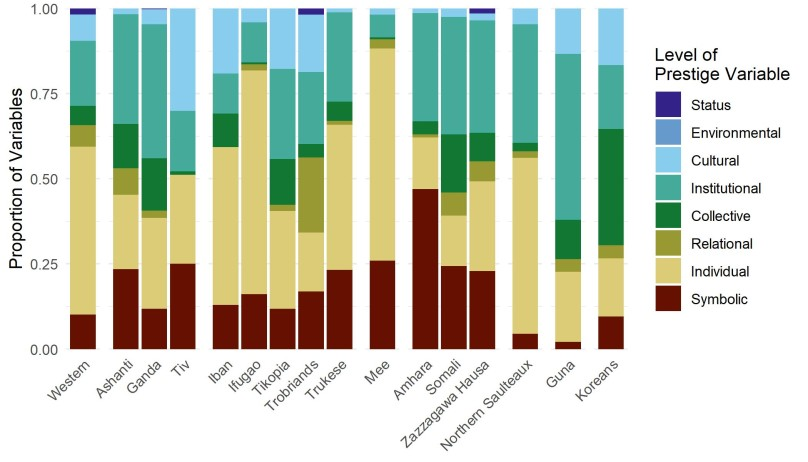{width="808"}  

    &nbsp;  
    
    **Mean proportion of propositions recalled from artificial creation stories by type of content bias and by speaker prestige.**  

    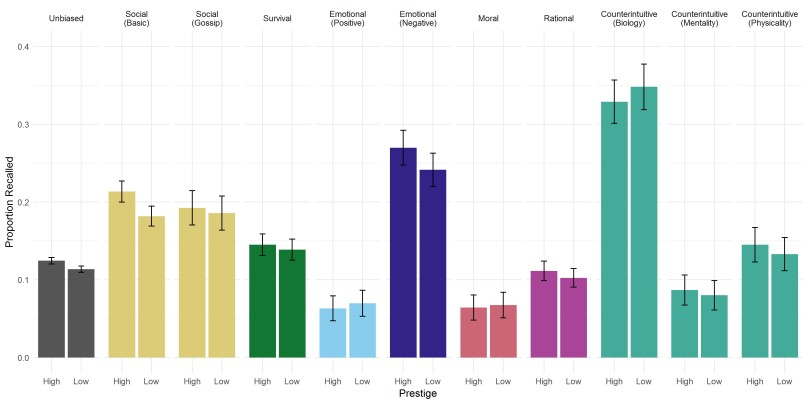{width="808"}  

    &nbsp;  

    **Color matrices of propositions recalled from artificial creation stories.**  

    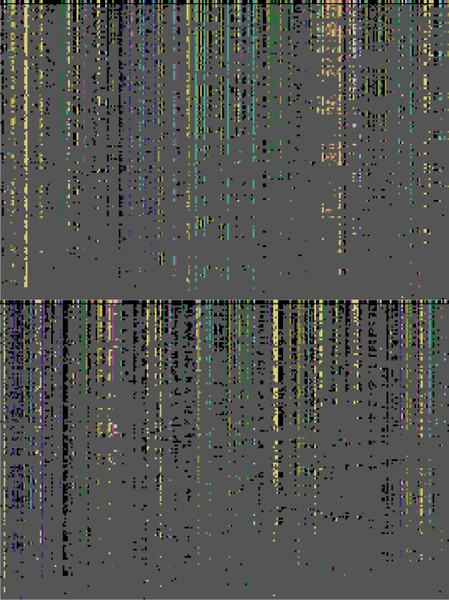{width="560"}  

<br>

* Volunteer data scientist for Trees, Water & People

    &nbsp;  

    **Random forest prediction of _Pinus ponderosa var. scopulorum_ habitat suitability under present conditions on Pine Ridge Reservation and Trust Land.**  

    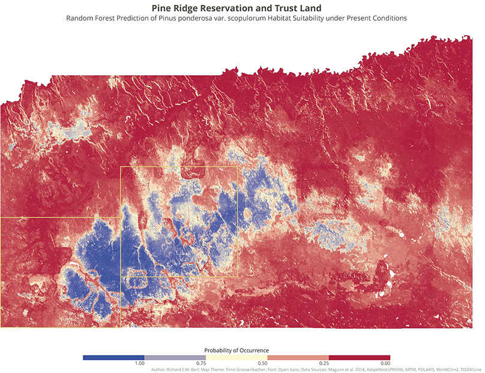{width="808"}  

    &nbsp;  

    **Correlation matrix heatmap of climatic and soil variables.**  

    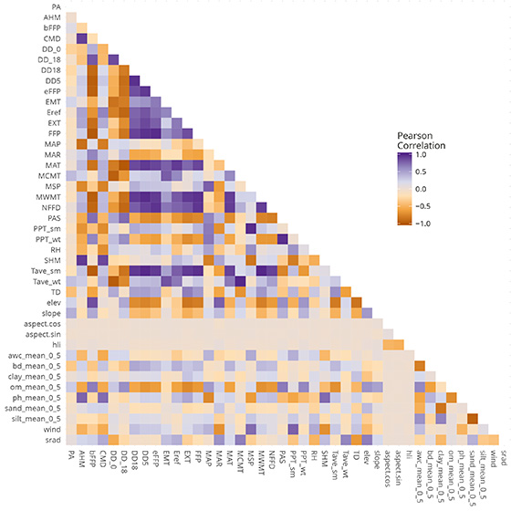{width="560"}  

    &nbsp;  
    
    **Logistic regression of _Pinus ponderosa var. scopulorum_ occurrence on burn area.**  

    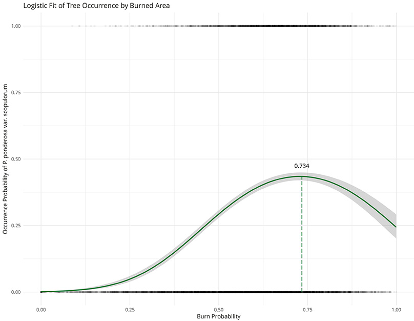{width="560"}  


<br><br>


### What we will cover in this course

* **See the [Syllabus](../syllabus_spring2019.html) and [Course Schedule](../schedule_spring2019.html)**  

* **Objectives (from [Syllabus](../syllabus_spring2019.html))**  

    * Set up a convenient computing workflow  

    * Write clean, thoroughly commented R code  

    * Recognize different types of data, how they are measured, and how they are
    handled in R  

    * Use the principle of 'tidy data' to effectively clean and format messy
    data sets  

    * Creatively explore data sets with descriptive statistics and rough
    visualizations prior to confirmatory analyses  

    * Clearly communicate results by visualizing data simply and effectively and
    by telling a compelling story with data  

    * Conduct basic statistical tests and linear regression modeling  

    * Explore advanced topics in data analysis, including dimensionality
    reduction and structural equation modeling  

    * Utilize R for your own research by developing a research question,
    collecting and wrangling data, and conducting the appropriate analyses  

    * Support reproducible research by documenting and embedding analyses in a
    written report  

    * Use the skills you have learned to communicate your process and results to
    a general audience  


<br>


### What we will not cover

* R Markdown (_kind of_) and R Notebook  

* LaTeX  

* Version control  
    * Git / GitHub  

        <!-- end of list -->

* Tibbles (`tibble` package) and piping (`magrittr` package)  

<br>

## Setting up a computing workflow

Create a folder structure for this course (see recommendations in required
reading by FitzJohn):

```{r, eval=FALSE}
nr592/
├── data/
├── docs/
├── figs/
├── output/
└┬─ R/
 ├─ assignment1.R
 └─ lecture01.R
```

Create a project for this course:

```{r, eval=FALSE}
nr592/
├── data/
├── docs/
├── figs/
├── output/
├── R/
└── nr592.Rproj
```


<br>


## Basic concepts in R

<big>**DON'T BE AFRAID TO FAIL!**</big>

Run current line/selection of code:  

* Ctrl+Enter (Windows)  
* Command+Enter (Mac)  

Source: [RStudio Keyboard Shortcuts](https://support.rstudio.com/hc/en-us/articles/200711853-Keyboard-Shortcuts)

### Objects

#### Variables

**Assignment**

```{r}
a = 1
b = 2
c = 42
```

```{r}
a
b
c
```


**Operations**

```{r}
a + b
a^2 + b^2
c / (a + b)
```

**Reassignment**

```{r}
a
b

a = a + b
a

a = a + b
a

a = a + b
a
```


### Scripts

Always work in scripts!

Open a new R script:

* Ctrl+Shift+N (Windows)  
* Command+Shift+N (Mac)  


#### Commenting  

```{r}
# "This line is commented out."
"This line is not commented out."
```

Comment/uncomment line:  

* Ctrl+Shift+C (Windows)  
* Command+Shift+C (Mac)  

**An example of well-commented code:**

```{r}
# Load iris data
data(iris)

# View structure of iris data
str(iris)

# Subset iris data to Species versicolor
irisVe = subset(x=iris, subset=Species == "versicolor")

# Find correlation between sepal length and petal length in versicolor
cor(x=irisVe$Sepal.Length, y=irisVe$Petal.Length)  # Result: 0.754049
```

### Packages

### Projects

Working directory  
Relative paths


## Data types and classes

### Numeric

Continuous (floating point)  
- Real  
- Complex  
Discrete  
- Binary (logical/boolean)  
- Integer

### Ordinal

Ordered factor

### Categorical

String (character)
Factor

### Date  
lubridate


## Data structures

### Vectors

Can only have one type

### Matrices

### Data Frames

### Lists

### Functions

```{r}
a
b
c

mean(x=c(a, b, c))
```

Let's make our own function to add the variable `a` to the variable `b`.

```{r, error=TRUE}
a_plus_b = function(a, b){
  aPlusB = a + b
  return(aPlusB)
}

a_plus_b(a=1, b=5)
```

What if we just use `aPlusB` instead of the whole function?

```{r, error=TRUE}
aPlusB(a=1, b=5)
```

Why doesn't this work?

`aPlusB` is a variable, not a function. You can't pass other variables to it.

Let's see what value is stored for the `aPlusB` variable.

```{r, error=TRUE}
aPlusB
```

Why doesn't this work?

`aPlusB` only exists inside the `a_plus_b` function. It doesn't have a value assigned to it in the "global environment" that we're working in. (Look in the "Environment" tab in RStudio.) `aPlusB` is called an "internal variable" because it only assigned inside the function when it's called, and is removed as soon as the function is finished running.


## Operations

### Common Functions
str()
names()
class()
dim()
length()
nrow()
ncol()
gc()
?
View()

### Subsetting

### Conditionals

### Iteration

#### Loops

#### Apply


<br><br>


([pdf](./lecture01.pdf) / [Rmd](./lecture01.Rmd))

<div class="tocify-extend-page" data-unique="tocify-extend-page" style="height: 0;"></div>