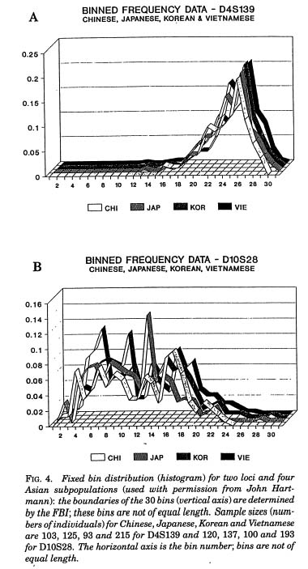

## Information design

### John Snow did know something... about cholera

**September 1854 cholera outbreak, Soho district, London**

{width="100%"}  
Source: John Snow, courtesy of [John Mackenzie, University of Delaware](https://www1.udel.edu/johnmack/frec682/cholera/index.html)  

<br><br><br><br>

### Bad figures are bad...

#### **Because of bad taste**

{width="100%"}  
Source: "The Tea is Drunk," Fortune Magazine, June 1934, courtesy of [Cornell University Library Digital Collections](https://digital.library.cornell.edu/catalog/ss:3293950)  

<br>

* "Data-to-ink" ratio

* Aesthetics

<br><br><br><br>

#### **Because of bad data**

{width="800"}  
Source: [\@TerribleMaps](https://twitter.com/TerribleMaps/status/929113032697044992)  

<br>

* Data quality

* Incorrect analyses

* Misleading or deceptive presentation

<br><br><br><br>

#### **Because of bad perception**

{height="560"}  
Source: Roeder, K. (1994). DNA fingerprinting: A review of the controversy. Statistical Science 9(2): 222-247, courtesy of [Karl Broman, University of Wisconsin-Madison](https://www.biostat.wisc.edu/~kbroman/topten_worstgraphs/)  

<br>

* Ease of interpretation

<br><br><br><br>

### **Tell a story**

{width="100%"}  
Source: Minna Sundberg, [Stand Still. Stay Silent #196](https://www.sssscomic.com/comic.php?page=196)  

<br><br><br><br>


## `base`

Useful for quick-and-dirty exploratory visualizations because you don't have to load any additional packages.

## `lattice`

Many examples of potential uses available online; especially good at showing relationships for multiple variables or across multiple plots. However, my opinion is that almost anything `lattice` can do can be done better by `ggplot2` with cleaner code.

## `ggplot2`

```{r, eval=FALSE}
install.packages("tidyverse")
# OR
install.packages("ggplot2")
```

```{r, warning=FALSE}
library(ggplot2)
```

A plot made using `ggplot()` has, at minimum, three elements:

* data set  
* aesthetics  
* geometry  

Let's get some data to work with.

Go to the Supplementary Materials for Stoddard et al. (2018) at: https://science.sciencemag.org/content/suppl/2017/06/21/356.6344.1249.DC1

Click "Data S1" to download the data, in Excel format, and put it in your `/data` folder.

```{r, warning=FALSE}
library(readxl)

egg = read_xlsx(path="./data/aaj1945_DataS1_Egg_shape_by_species_v2.xlsx",
                      sheet=1)
egg = as.data.frame(egg)
```

```{r}
head(egg)
str(egg)
```

Those spaces in the column names may cause problems, so let's fix them.

```{r}
colnames(egg)
colnames(egg)[7:9] = c("AvgLength","NumberOfImages","NumberOfEggs")
```

And check out the help page for the `ggplot()` function before we use it.

```{r, eval=FALSE}
?ggplot
```

Not very helpful... A better resource is the tidyverse page for `ggplot2`: https://ggplot2.tidyverse.org/

Now we can make our first plot with the three elements needed: data, aesthetic mappings, and a geometry.

```{r, warning=TRUE}
ggplot(data=egg, mapping=aes(x=Asymmetry, y=Ellipticity)) +
  geom_point()
```

The function warns us that we have some missing values. Let's find them and remove them.

```{r}
egg[is.na(egg$Asymmetry),]
```

```{r}
egg[is.na(egg$Ellipticity),]
```

```{r}
tail(egg)
```

Sometimes Excel spreadsheets can have empty rows at the bottom that get interpreted as data.

```{r}
egg = egg[-c(1401,1402),]
tail(egg)
```

```{r, warning=TRUE}
ggplot(data=egg, mapping=aes(x=Asymmetry, y=Ellipticity)) +
  geom_point()
```

The `ggplot2` reference page on the tidyverse website has a list of `geom`s and other layers you can apply: https://ggplot2.tidyverse.org/reference/

One of the first ones is `geom_abline()`, which is one way to add a reference line to our plot.

```{r, eval=FALSE}
?geom_abline
```

```{r}
ggplot(data=egg, mapping=aes(x=Asymmetry, y=Ellipticity)) +
  geom_point() +
  geom_abline(slope=1, intercept=0)
```

We see that every point is above the 1:1 line; that is, an egg's ellipticity is always greater than its asymmetry.

Let's try a bar chart now. We need a categorical X value.

```{r, error=TRUE}
ggplot(data=egg, mapping=aes(x=Order, y=Asymmetry)) +
  geom_bar()
```

Well, it seems like it wants us to remove the Y variable, so let's try that.

```{r}
ggplot(data=egg, mapping=aes(x=Order)) +
  geom_bar()
```

This gives us a histogram, which is not what we wanted, but let's work with it. The first issue is that we can't read the tick labels on the X axis (in `ggplot` terms, the axis label here is "Order" and the tick labels are the labels for the levels on that axis).

Let's rotate them and make them a bit smaller so we can see them.

```{r}
ggplot(data=egg, mapping=aes(x=Order)) +
  geom_bar() +
  theme(axis.text.x=element_text(angle=50, hjust=1, size=7))
```

Looks better, for a histogram. But we wanted to see the `Asymmetry` value for each order.

Let's tell `ggplot` that we want to see the mean values. For this we need to change the `stat` argument of `geom_bar()` from `count` (its default, which produces a histogram) to `summary`, and specify that the function we want to use to calculate our Y axis values is `mean()`.

```{r}
ggplot(data=egg, mapping=aes(x=Order, y=Asymmetry)) +
  geom_bar(stat="summary", fun.y="mean") +
  theme(axis.text.x=element_text(angle=50, hjust=1, size=7))
```

Looks good. But for bar plots it's always good to have error bars. We'll need to use `geom_errorbar()`.

```{r, eval=FALSE}
?geom_errorbar
```

What if we want to use confidence intervals for those bars? How do we calculate them? Well, one way is:

```{r, eval=FALSE}
?mean_cl_normal
```

But for this, it shows we need to load the `Hmisc` package.

```{r, eval=FALSE}
install.packages("Hmisc")
```

```{r, warning=FALSE}
library(Hmisc)
```

```{r}
ggplot(data=egg, mapping=aes(x=Order, y=Asymmetry)) +
  geom_bar(stat="summary", fun.y="mean") +
  geom_errorbar(stat="summary", fun.data="mean_cl_normal") +
  theme(axis.text.x=element_text(angle=50, hjust=1, size=7))
```

This put our axes out of whack. Let's fix them, and reduce the width of the error bars.

```{r}
ggplot(data=egg, mapping=aes(x=Order, y=Asymmetry)) +
  geom_bar(stat="summary", fun.y="mean") +
  geom_errorbar(stat="summary", fun.data="mean_cl_normal",
               width=0.5) +
  ylim(c(0,0.4)) +
  theme(axis.text.x=element_text(angle=50, hjust=1, size=7))
```

Hm. What happened?

Instead of just "zooming in" on the area we wanted, it also dropped the confidence intervals that went outside that range.

```{r, eval=FALSE}
?ylim
```

```{r, eval=FALSE}
?coord_cartesian
```

```{r}
ggplot(data=egg, mapping=aes(x=Order, y=Asymmetry)) +
  geom_bar(stat="summary", fun.y="mean") +
  geom_errorbar(stat="summary", fun.data="mean_cl_normal",
               width=0.5) +
  coord_cartesian(ylim=c(0,0.4)) +
  theme(axis.text.x=element_text(angle=50, hjust=1, size=7))
```

Good. We could do more to try to bring the lower intervals up to zero, but we can leave that for now (it would be easier to do using the `summarySE()` method shown later).

Gray on gray is boring. Let's add some fill colors (even though, in this case, they don't add anything meaningful to the plot).

```{r}
ggplot(data=egg, mapping=aes(x=Order, y=Asymmetry, fill=Order)) +
  geom_bar(stat="summary", fun.y="mean") +
  geom_errorbar(stat="summary", fun.data="mean_cl_normal",
               width=0.5) +
  coord_cartesian(ylim=c(0,0.4)) +
  theme(axis.text.x=element_text(angle=50, hjust=1, size=7))
```

The legend takes up half the plot. Let's remove it.

```{r}
ggplot(data=egg, mapping=aes(x=Order, y=Asymmetry, fill=Order)) +
  geom_bar(stat="summary", fun.y="mean") +
  geom_errorbar(stat="summary", fun.data="mean_cl_normal",
               width=0.5) +
  coord_cartesian(ylim=c(0,0.4)) +
  guides(fill=FALSE) +
  theme(axis.text.x=element_text(angle=50, hjust=1, size=7))
```

If we want to specify a single color, we can move our `fill` argument to the `geom_bar()` function and specify what color we want (either by name or hexadecimal value, e.g. "#FF0000").

You can find a list of colors defined in R here: http://www.stat.columbia.edu/~tzheng/files/Rcolor.pdf

```{r}
ggplot(data=egg, mapping=aes(x=Order, y=Asymmetry)) +
  geom_bar(stat="summary", fun.y="mean", fill="red") +
  geom_errorbar(stat="summary", fun.data="mean_cl_normal",
               width=0.5) +
  coord_cartesian(ylim=c(0,0.4)) +
  guides(fill=FALSE) +
  theme(axis.text.x=element_text(angle=50, hjust=1, size=7))
```

As with everything in R, there are multiple ways to do the same thing.

We can use the `stat_summary()` function instead of the `geom` functions, and specify the `geom` in the arguments:

```{r}
ggplot(data=egg, mapping=aes(x=Order, y=Asymmetry, fill=Order)) +
  stat_summary(geom="bar", fun.y=mean) +
  stat_summary(geom="errorbar", fun.data=mean_cl_normal,
               width=0.5) +
  coord_cartesian(ylim=c(0,0.4)) +
  guides(fill=FALSE) +
  theme(axis.text.x=element_text(angle=50, hjust=1, size=7))
```

Another, more useful way is to use the `summarySE()` function to make a new data frame with the information we need.

If I know a function that I want to use but can't remember what package it's in, I can search from it (as long as I have that package installed).

```{r, eval=FALSE}
??summarySE  # Will only search packages that you have installed
```

It's in `Rmisc`, from the creator of the [R Companion website](http://rcompanion.org/handbook/C_02.html).

```{r, eval=FALSE}
install.packages("Rmisc")
```

```{r, warning=FALSE}
library(Rmisc)
```

Now we can read the help file for the function.

```{r, eval=FALSE}
?summarySE
```

And use it to make a new data frame:

(Note: Pay attention to the arguments. Variable names need to be given as characters, and the `groupvars` argument wants a vector.)

```{r}
eggAsymByOrder = summarySE(data=egg,
                           measurevar="Asymmetry",
                           groupvars=c("Order"))
```

```{r}
eggAsymByOrder
```

We can see some of these are missing values (`NA` or `NaN`, "not a number") because those orders only had one observation (see the `N` column) and you can't get a confidence interval from one value.

```{r}
ggplot(data=eggAsymByOrder, mapping=aes(x=Order, y=Asymmetry, fill=Order)) +
  geom_bar(stat="identity") +
  geom_errorbar(aes(ymin=Asymmetry-ci, ymax=Asymmetry+ci),
               width=0.5) +
  coord_cartesian(ylim=c(0,0.4)) +
  guides(fill=FALSE) +
  theme(axis.text.x=element_text(angle=50, hjust=1, size=7))
```


<br><br>


([pdf](./lecture05.pdf) / [Rmd](./lecture05.Rmd))

<div class="tocify-extend-page" data-unique="tocify-extend-page" style="height: 0;"></div>