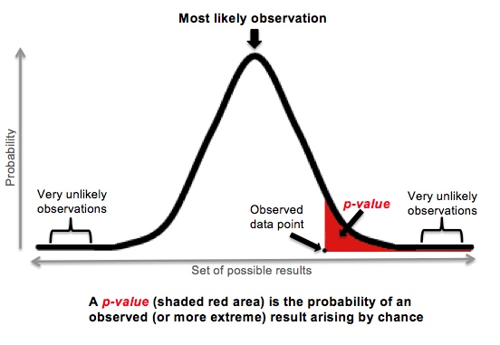

## Hypothesis testing

### **What is a _p_-value?**

<em>"The probability of getting the observed result, or a more extreme result, if the null hypothesis is true."</em>

Source: [McDonald, Basic concepts of hypothesis testing](http://www.biostathandbook.com/hypothesistesting.html)

{width="552"}  
Source: [Pomeroy, R. (2016). The biggest myth about p-values. RealClearScience.](https://www.realclearscience.com/blog/2016/11/07/the_biggest_myth_about_p-values.html)

<br>

Now let's get some data!

Go to the page for the PanTHERIA database (hosted by the Ecological Society of America) at: http://esapubs.org/archive/ecol/E090/184/

Near the bottom, download the text file with "WR05" in the name (referring to the 2005 edition of a mammal classification book) and put it in your `/data` folder.

Metadata and descriptions of all the variables are available here: http://esapubs.org/archive/ecol/E090/184/metadata.htm

```{r}
pan = read.table("./data/PanTHERIA_1-0_WR05_Aug2008.txt", header=T, sep="\t",
                 na.strings=c("-999","-999.00"), stringsAsFactors=F)
```

```{r}
str(pan)
```

Column names are messy. Let's try to clean them up.

```{r, warning=FALSE}
library(stringr)
```

Loop through each column name, check if it has an underscore, and try to split it into two pieces using the underscore as a separator:

```{r}
for (i in 1:length(colnames(pan))) {
  if (grepl("_", colnames(pan)[i])) {
    colnames(pan)[i] = str_split_fixed(colnames(pan)[i], "_", n=2)[2]
  }
}

colnames(pan)
```

<br>

## Statistical tests

### 1 Nominal Variable

#### **Exact binomial test**

```{r eval=FALSE}
?binom.test
```

Classic example: toss a coin a bunch of times and test whether the probability of getting a heads is different from 0.5.

**"Is an artiodactyl species more likely to be an herbivore than an omnivore?"**

```{r}
table(pan$TrophicLevel[pan$Order == "Artiodactyla"])

binom.test(table(pan$TrophicLevel[pan$Order == "Artiodactyla"]),
           alternative="greater")
```

<br>

### 2 Nominal Variables

#### **Fisher's exact test**

```{r eval=FALSE}
?fisher.test
```

Tests a contingency table to ask whether the values of each category differ across groups.

**"Does the time of day that primate species are active differ across families?"**

```{r}
table(pan$ActivityCycle[pan$Order == "Primates"],
      pan$Family[pan$Order == "Primates"])
```

Notice it's still a 2x2 table, even though each variable has a bunch of categories.

```{r error=TRUE}
fisher.test(table(pan$ActivityCycle[pan$Order == "Primates"],
                  pan$Family[pan$Order == "Primates"]))
```

It doesn't want to do it, because it's a big table, but we can force it to simulate a _p_-value, which will be good enough for now (see the McDonald page for alternatives).

```{r}
fisher.test(table(pan$ActivityCycle[pan$Order == "Primates"],
                  pan$Family[pan$Order == "Primates"]),
            simulate.p.value=T)
```

<br>

### 1 Measurement Variable

#### **One-sample t-test**

```{r eval=FALSE}
?t.test
```

Is the mean of a set of values different from some value I specify?

**"Does the forearm length of fruit bats (Family Pteropodidae) tend to be greater than 100 mm?"**

```{r}
na.omit(pan$AdultForearmLen_mm[pan$Family == "Pteropodidae"])[1:20]

mean(pan$AdultForearmLen_mm[pan$Family == "Pteropodidae"], na.rm=T)

t.test(na.omit(pan$AdultForearmLen_mm[pan$Family == "Pteropodidae"]),
       mu=100, alternative="greater")
```

<br>

### 1 Nominal Variable and 1 Measurement Variable

#### **Two-sample t-test**

```{r eval=FALSE}
?t.test
```

Do the means of two sets of values differ?

**"Does the average forearm length of fruit bats (Family Pteropodidae) differ between species that have one litter of offspring per year and species that have two?"**

```{r}
na.omit(pan$AdultForearmLen_mm[pan$Family == "Pteropodidae" & pan$LittersPerYear == 1])[1:10]

na.omit(pan$AdultForearmLen_mm[pan$Family == "Pteropodidae" & pan$LittersPerYear == 2])[1:10]

t.test(na.omit(pan$AdultForearmLen_mm[pan$Family == "Pteropodidae" & pan$LittersPerYear == 1]),
       na.omit(pan$AdultForearmLen_mm[pan$Family == "Pteropodidae" & pan$LittersPerYear == 2]))
```

Note that if you have paired values (like pre- and post-test values from the same individuals), then a paired t-test is more powerful (better chance of detecting a significant effect with a smaller sample size) and you should use that instead. You can do this in R by setting the `t.test()` argument `paired=TRUE`.

<br>

### 2 Measurement Variables

#### **Correlation test**

```{r eval=FALSE}
?cor.test
```

Are two variables correlated (positively or negatively)?

**"Is wild mammal population density associated with human population density?"**

```{r}
pan[complete.cases(pan$PopulationDensity_n.km2, pan$HuPopDen_Mean_n.km2),
    c("PopulationDensity_n.km2", "HuPopDen_Mean_n.km2")][1:20,]

cor.test(pan[complete.cases(pan$PopulationDensity_n.km2,
                            pan$HuPopDen_Mean_n.km2),
             "PopulationDensity_n.km2"],
         pan[complete.cases(pan$PopulationDensity_n.km2,
                            pan$HuPopDen_Mean_n.km2),
             "HuPopDen_Mean_n.km2"])
```

<br>

## Regression

Correlation and regression can both examine how two variables are associated.

So what's the difference between correlation and regression?  

1. Causality: Correlation measures association, but regression measures one variable's ability to predict the value of another variable (which is "predictive," not necessarily always causal).  
2. Estimation: Regression estimates parameter values (e.g. the `m` and `b` of a `y = mx + b` equation) so that you can create a model of your data and plot a line of best fit through it.  
3. Prediction: Using the model you estimate, you can plug in new values to predict what the response should be.  

### 2 Measurement Variables

#### **Linear regression**

```{r eval=FALSE}
?lm
```

Does one variable predict another (positively or negatively)?

**"Does litter size predict home range in canids?"**

```{r}
panCanid = pan[pan$Family == "Canidae",]
panCanid = panCanid[complete.cases(panCanid$LitterSize,
                                   panCanid$HomeRange_km2),]

panCanidModel = lm(HomeRange_km2 ~ LitterSize, data=panCanid)
summary(panCanidModel)
```

Response (Y variable) comes first, followed by predictors (X variables). Read the `~` as "as a function of" or "as a result of."

So, from this, our model equation would look something like:

`Y` = `b` + `m` * `X`

`HomeRange_km2` = `-85.60` + `28.07` * `LitterSize`

We can plot our regression line:

```{r, warning=FALSE}
library(ggplot2)
```

```{r}
ggplot(panCanid, aes(x=LitterSize, y=HomeRange_km2)) +
  geom_point() +
  geom_smooth(method="lm", se=F, color="red")
```

This re-runs the `lm()` function with the specified variables to plot the line.

But if we want to make sure we're using our own model estimates, we can `fortify()` our model results, which turns them into a data frame:

```{r}
fortify(panCanidModel)
```

We can then use the `.fitted` values (the result of plugging each of those `LitterSize` values into the model) as the values for our line:

```{r}
ggplot(panCanid, aes(x=LitterSize, y=HomeRange_km2)) +
  geom_point() +
  geom_line(data=fortify(panCanidModel), aes(x=LitterSize, y=.fitted),
            color="red", size=1)
```

Finally, we can use our model to predict new responses.

```{r eval=FALSE}
?predict
```

```{r}
predict(panCanidModel, newdata=data.frame(LitterSize=1:10))

range(panCanid$LitterSize)
```

Note we can predict the results of values outside the range of our data.

If we want to use a different "link function" (i.e. if we think our data fit a different distribution), we can use a generalized linear model with `glm()`. We can also do basic linear regression with `glm()`, because `lm()` is a special case of `glm()`.

We also see, with our plot, that we probably should have checked for and removed outliers first. Outliers can have a huge effect on the parameters of your model and its accuracy, because the model fitting procedure has to take those outliers into account when it's trying to find the line that fits everything as closely as possible.

<br>

### 3+ Measurement Variables

#### **Multiple regression**

Do any of these variables predict another (positively or negatively)?

First, let's make sure we're working with the complete cases for our new variable, `DispersalAge_d`.

```{r}
panCanid2 = pan[pan$Family == "Canidae",]
panCanid2 = panCanid2[complete.cases(panCanid2$LitterSize,
                                     panCanid2$DispersalAge_d,
                                     panCanid2$HomeRange_km2),]
```

Same function, we just add predictor variables with `+`:

```{r}
panCanidModel2 = lm(HomeRange_km2 ~ LitterSize + DispersalAge_d, data=panCanid2)
summary(panCanidModel2)
```

Now that we take the effect of dispersal age into account, litter size is no longer significant. But dispersal age isn't significant either ("almost significant" or "marginally significant" don't count--it's either below your alpha value or it's not), which is incredibly frustrating. There must be something going on.

Let's check for interactions. We can do so in the model by changing the `+` to a `*` to specify it should include an interaction term between our main effects:

```{r}
panCanidModel3 = lm(HomeRange_km2 ~ LitterSize * DispersalAge_d, data=panCanid2)
summary(panCanidModel3)
```

Now everything is significant, including our interaction term.

What is an interaction?

<em>"The effect of Factor A is different, depending on which level of Factor B we’re talking about."</em>

Source: [Navarro, Section 16.2.1](https://learningstatisticswithr.com/book/anova2.html#interactions)

Significant interactions are generally bad news, because it can be very difficult to explain them in a way that is biologically (or physically, or socially...) meaningful.

Sometimes it is helpful to visualize the effects of the two predictors to see what the interaction is. But to do so with measurement variables, we have to make them discrete so we can see the change according to different levels. There are different ways to do this "binning." For `LitterSize`, let's split it by `Low` and `High` based on the median value:

```{r}
panCanid2$LitterSizeD = ifelse(panCanid2$LitterSize < median(panCanid2$LitterSize),
                              "Low", "High")
```

And for `DispersalAge_d`, we'll tell R we want to split it into 5 intervals using the `cut()` function:

```{r}
panCanid2$DispersalAge_dD = cut(panCanid2$DispersalAge_d, 5)
```

You could also use quantiles or `cut2()` from the `Hmisc` package to cut by intervals of equal numbers of values rather than equal spacing.

```{r}
ggplot(panCanid2, aes(x=DispersalAge_dD, y=HomeRange_km2, group=LitterSizeD)) +
  geom_line(aes(color=LitterSizeD))
```

Like I mentioned before, difficult to interpret. Usually, in an interaction plot, the lines will cross each other (showing that the relationships are different for each level of the factor), instead of being parallel (which would show similar effects); here, they do cross in the first level of dispersal age, though it's difficult to see.


<br><br>


([pdf](./lecture07.pdf) / [Rmd](./lecture07.Rmd))

<div class="tocify-extend-page" data-unique="tocify-extend-page" style="height: 0;"></div>
