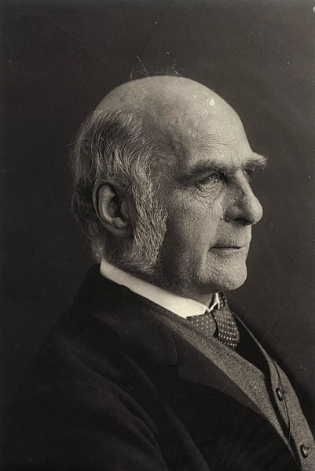
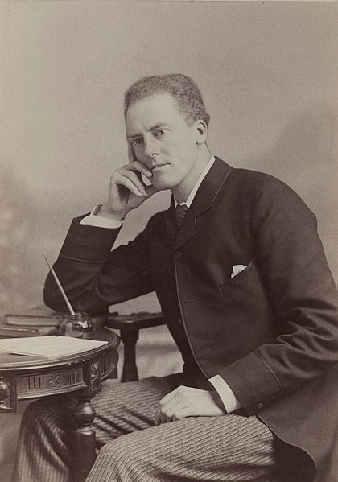
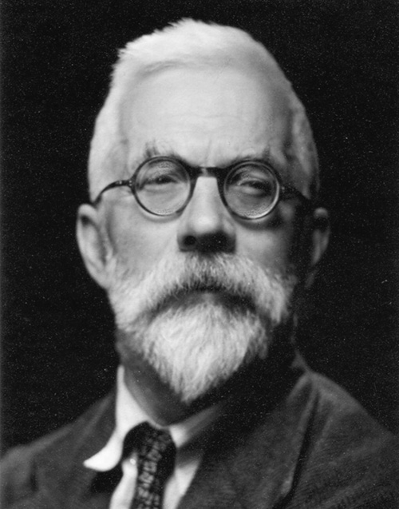

## Regression

New day, new data set...

This one is listed as "S5 Table" at the following link: https://journals.plos.org/plosone/article?id=10.1371/journal.pone.0150798#sec020

Download the CSV and place it in your `/data` folder.

The source is:

Dinkins, J. B., et al. (2016). Microhabitat conditions in Wyoming’s sage-grouse core areas: Effects on nest site selection and success. PLOS ONE, 11(3), e0150798. doi: [10.1371/journal.pone.0150798](https://doi.org/10.1371/journal.pone.0150798)

Descriptions of the variables are scattered around the paper and in the four other identically-titled supporting tables.

```{r}
grouse = read.csv("./data/journal.pone.0150798.s005.CSV", header=T)
```

```{r}
str(grouse)
```

For these analyses, we'll convert `YEAR` to a factor (categorical variable).

```{r}
grouse$YEAR = as.factor(grouse$YEAR)
```


### Logistic regression

```{r eval=FALSE}
?glm
```

Does one variable predict another (positively or negatively), when the outcome is nominal?

**"Does the amount of litter within 10 meters of a site predict whether a greater sage-grouse chooses to nest there?"**

```{r}
grouseGLM = glm(Type ~ Litter_10M, data=grouse, family="binomial")
summary(grouseGLM)
```


### Multiple logistic regression

Do any of these variables predict another (positively or negatively), when the outcome is nominal?

```{r}
grouseGLM2 = glm(Fate ~ annual_prec_30year + Rock_3M + Cactus_3M + BioCrust_3M,
                data=grouse[grouse$Type == "Nest",], family="binomial")
summary(grouseGLM2)
```

<br>

### Mixed effects model

Do any of these variables predict another (positively or negatively), when I also have one or more variables that describe a subset of the data I could have collected?

```{r eval=FALSE}
install.packages("lme4")
```

```{r, warning=FALSE}
library(lme4)
```

```{r eval=FALSE}
?glmer
```

```{r}
grouseME = glmer(Type ~ Litter_10M + Rock_10M + (1 | YEAR),
                 data=grouse, family="binomial")
summary(grouseME)
```

<br>

### Analysis of variance (ANOVA)

#### One-way (1 Nominal Variable and 1 Measurement Variable)

Do the means of a variable differ by group?

**At sites with greater sage-grouse nests that hatched, was the mean percentage of shrub cover within 10 meters different each year?**

```{r}
grouseAOV = aov(Shrub_10M ~ YEAR,
                data=grouse[grouse$Type=="Nest" & grouse$Fate=="hatch",])
anova(grouseAOV)  # summary() works fine too
```

But this didn't really answer our question. Year matters, but which years are different?

#### Multiple comparisons (or "post hoc" tests)

```{r}
TukeyHSD(grouseAOV)
```

Notice the _p_-values have been "adjusted." We'll come back to why soon.

<br>

#### Two-way (2 Nominal Variables and 1 Measurement Variable)

**Does the amount of bare ground cover differ by core/non-core area or by nesting/non-nesting site?**

```{r}
grouseAOV2 = aov(Bground_10M ~ CORE_AREA + Type,
                 data=grouse)
summary(grouseAOV2)
```

Nested ANOVA is a different type of analysis, when one variable is nested within another (e.g. plots and subplots within each plot). Look into it for more detail if you have this kind of data.

<br>

#### Quantile-quantile plots

Check for normality, one of the assumptions of ANOVA.

```{r}
plot(grouseAOV2)
```

If we just want the Q-Q plot, we can also use `qqnorm()`.

```{r eval=FALSE}
?qqnorm
```

```{r}
names(grouseAOV2)
```

```{r}
qqnorm(grouseAOV2$residuals)
qqline(grouseAOV2$residuals, col="red")
```

<br>

### Correcting for multiple comparisons

```{r}
myT1 = t.test(grouse$ARTR_10M[grouse$Fate == "hatch"],
              grouse$ARTR_10M[grouse$Fate == "fail"])
myT1

myT2 = t.test(grouse$Shrub_H_10M[grouse$Fate == "hatch"],
              grouse$Shrub_H_10M[grouse$Fate == "fail"])
myT2

myT3 = t.test(grouse$FoodF_10M[grouse$Fate == "hatch"],
              grouse$FoodF_10M[grouse$Fate == "fail"])
myT3

myT4 = t.test(grouse$Rock_10M[grouse$Fate == "hatch"],
              grouse$Rock_10M[grouse$Fate == "fail"])
myT4

myT5 = t.test(grouse$BioCrust_10M[grouse$Fate == "hatch"],
              grouse$BioCrust_10M[grouse$Fate == "fail"])
myT5
```

If the probability of a false positive is 0.05 for each one of these tests...

Then the probably of _at least one_ false positive in five tests is...

```{r}
1 - (1 - 0.05)^5
```

To correct it, we need to adjust our _p_-values.

```{r}
myPVals = c(myT1$p.value, myT2$p.value, myT3$p.value, myT4$p.value,
            myT5$p.value)
myPVals
```

```{r eval=FALSE}
?p.adjust
```

```{r}
p.adjust(myPVals, method="bonferroni")
```

```{r}
p.adjust(myPVals, method="fdr")
```

<br>

And now a quick diversion into the _alternative_ history of statistics, where we talk about how...

<br>

## **Galton, Pearson, and Fisher were terrible people**

### Sir Francis Galton

{width="250"}  
Source: [National Portrait Gallery, London](https://www.npg.org.uk/collections/search/portrait/mw127193)  

Charles Darwin's half-cousin  

Contributions:

* Correlation  
* Regression  
* Standard deviation  
* Questionnaires  

and...

* _Eugenics_  

<em>"My proposal is to make the encouragement of the Chinese settlements at one or more suitable places on the East Coast of Africa a par of our national policy, in the belief that the Chinese immigrants would not only maintain their position, but that they would multiply and their descendants supplant the inferior Negro race. I should expect the large part of the African seaboard, now sparsely occupied by lazy, palavering savages... might in a few years be tenanted by industrious, order loving Chinese... average negroes possess too little intellect, self-reliance, and self-control to make it possible for them to sustain the burden of any respectable form of civilization without a large measure of external guidance and support."</em>  

Source: _[Africa for the Chinese: To the Editor of The Times (1873)](http://galton.org/letters/africa-for-chinese/AfricaForTheChinese.htm)_

It's worth thinking about how these ideas continue in our own field (using different language) in the thinking and intent behind both local and international conservation practices.

<br>

### Karl Pearson

**Galton Professor of Eugenics, University College London**

{width="250"}  
Source: [National Portrait Gallery, London](https://www.npg.org.uk/collections/search/portrait/mw160879/)  

Contributions:

* Correlation coefficient  
* _p_-value  
* Hypothesis testing  
* Chi-squared test  
* Principal component analysis  
* Histogram  

<em>"History shows me one way, and one way only, in which a high state of civilization has been produced, namely, the struggle of race with race, and the survival of the physically and mentally fitter race. If you want to know whether the lower races of man can evolve a higher type, I fear the only course is to leave them to fight it out among themselves, and even then the struggle for existence between individual and individual, between tribe and tribe, may not be supported by that physical selection due to a particular climate on which probably so much of the Aryan’s success depended."</em>  

Source: _[National Life from the Stand-point of Science: An Address Delivered at Newcastle (1901)](https://archive.org/stream/nationallifefro00peargoog#page/n22/mode/2up)_

<br>

### Sir Ronald A. Fisher

**Galton Professor of Eugenics, University College London**

{width="250"}  
Source: [University of Adelaide Library](https://drmc.library.adelaide.edu.au/dspace/handle/2440/81669)  

Contributions:

* Null hypothesis  
* Analysis of variance (ANOVA)  
* Maximum likelihood  
* Experimental randomization  
* Modern synthesis of biology  

<em>"In one respect the theory of selection by climate and disease appears to possess an advantage over that of race mixture. If the latter were the only agency at work, the disappearance of the ruling class would be accompanied by a permanent improvement of the natives. The effect of successive conquests should accumulate; so that we should expect that a people, such as the Egyptians, should be reasonably far advanced towards the type of a ruling race. The reverse appears to be the case. The effect of the selective influence of climate and disease, on the other hand, would appear to undo completely the racial benefits of an invasion."</em>  

Source: _[The Genetical Theory of Natural Selection (1930)](https://archive.org/details/geneticaltheoryo031631mbp/page/n267)_

<br>

**IMPORTANT NOTE:**

I vehemently oppose the abhorrent notions expressed in the above quotations. They represent the worst misuses of social science--social Darwinism and scientific racism--and have been used to justify centuries of colonialism and oppression. The excuse that they were "products of their time" is inadequate, because they were among the most prominent proponents of these ideas and lent their authority and legitimacy to them. Moreover, they developed and incorrectly applied a number of their methods specifically in attempts to support their biased views on race (and see the "rejoinder" at the end of Galton's letter for evidence that not everyone thought this way, even in Galton's time). Their advancement of racist "science" directly influenced the rise of white supremacism in Nazi Germany and elsewhere, and its legacy continues today with the recent resurgence of so-called "race realism." These men have done enduring damage to science and to generations of people and do not deserve to be celebrated.


<br><br>


([pdf](./lecture08.pdf) / [Rmd](./lecture08.Rmd))

<div class="tocify-extend-page" data-unique="tocify-extend-page" style="height: 0;"></div>
