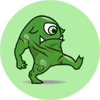
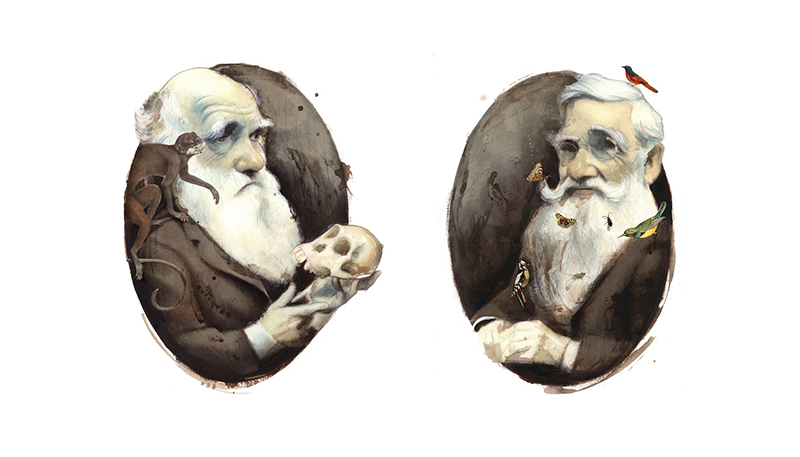

<h1 class="page-title">Beasts Evolve!</h1>
<h1 class="page-stitle">Student Packet</h1>

Developed by...

Richard E.W. Berl, Human Dimensions of Natural Resources 
Gareth Halladay, Computer Science 
Reyes Murrieta, Microbiology, Immunology, and Pathology

as part of the GAUSSI Program (<a href="http://gaussi.colostate.edu/" target="_blank">http://gaussi.colostate.edu/</a>) at Colorado State University.

Materials are freely available under a Creative Commons license at: <a href="http://rewberl.github.io/beasts/" target="_blank">http://rewberl.github.io/beasts/</a>

# Concept

Understand the theory of evolution by natural selection by creating a population of fictional “beasts” and observing evolution in action over multiple generations.

# Introduction

Back in the 1800’s, two British naturalists—one named Charles Darwin and the other named Alfred Russell Wallace—traveled the world and saw all kinds of fascinating and bizarre plants and animals. Darwin set out on an oceanic voyage, stopping at the Galapagos Islands where he saw its many curious finches, while Wallace explored the jungles of the Amazon and Southeast Asia. After arriving back in England and studying the scientific data and specimens they had collected, they each came to a surprising conclusion. They realized that every living thing on our planet, from the smallest beetle to the tallest tree, is affected by a powerful process called **natural selection** that shapes the **evolution** of species.

The idea that organisms change over time was not new. Ancient Greek, Roman, Arab, and Chinese philosophers had all come up with evolutionary ideas many years before Darwin and Wallace. The part of their new theory that was truly extraordinary was that nature “selects” which individuals are able to survive and reproduce by how successful they are at living in their environment. Some individuals are slightly more likely to survive than others because every individual has a slightly different set of **traits**. All are competing for the same space and resources, but there is not enough for everyone to survive. Some traits help individuals to survive better in a specific environment—these are called **adaptations**. If they are more likely to survive, then they also have more chances to reproduce. Over many generations of the most successful individuals having more children than everyone else and passing their adaptations on to those children, the population as a whole becomes more adapted to its environment. This is **evolution by natural selection**.

But the process is never finished. It is still important to have **variation** in traits because, if the environment changes, the traits that used to be most adaptive may not be the best anymore. Individuals with different traits may now be more successful. Adaptations always depend on the environment at one specific time and place. Imagine a lizard stuck in a blizzard, or a fish after its pond dries up. One way to bring new variation into a population is through **mutations**, which can then be passed on to offspring if they are adaptive. This allows populations to continue to adapt to new or changing environments.

"Darwin" and "Alfred Russell Wallace" by Fernando Vicente (<a href="http://www.fernandovicente.es" target="_blank">http://www.fernandovicente.es</a>)

# Vocabulary

Evolution... is a change in a population over time. Usually, biologists use this term to mean a change in the population’s genes over time, but we can look at single traits, too. Individuals do not evolve, because we look at the average of the whole population. Evolution can happen over many generations or in just one.

Natural Selection... is a process by which the individuals that are most successful in their environment are more likely to survive and reproduce. This means that they will have more children than other individuals in the next generation. These children will then also be more successful, making them more likely to survive and reproduce. By “selecting” the individuals that survive and reproduce, this natural process leads to evolution. When humans choose or have an effect on which individuals survive and reproduce (like in dog breeding), this is called artificial selection.

Traits... are characteristics of an organism which are partially created and controlled by their genes. Traits can include any part of an organism, including its organs and limbs, its behaviors and instincts, and the reactions of proteins and chemicals within its cells.

Adaptations... are traits that make an individual more successful in an environment at one specific time and place. These traits tend to increase in a population over time, if the environmental conditions remain the same, because of natural selection. If environmental conditions change, different traits may become adaptive in that environment.

Variation... is the presence of many different traits within a population, rather than just one type. Natural selection tends to reduce variation within a population by only selecting the most successful traits. Traits can then become “fixed” in a population, which means that only one type is left. Mutation is the main way that new variation is introduced.

Mutations... are random mistakes in an individual’s genetic code that create new variation in traits. Mutations can be helpful or harmful, but are usually harmful since most traits have been evolving and adapting together for a long time. Mutations that help an organism become more successful in its environment are very rare.

The Scientific Method... is the process that scientists use to answer a question or solve a problem. You begin by observing the world, then thinking up new questions or ideas, predicting what the answer may be (by creating a hypothesis), and testing your hypothesis. After looking at the results of your tests, you can make changes to your prediction or ask new questions and start the process again.

Hypothesis... is a proposed explanation for an observation, event, or other occurrence that is based on existing scientific knowledge and can be tested using the Scientific Method. After a hypothesis has been tested many times, collecting a large amount of evidence that supports that hypothesis and rules out other possible explanations, it becomes a scientific theory.

# Today’s Activity

In this activity, you will create a fictional “beast” to illustrate the effects of natural selection on populations of organisms. All of the beasts in your class will make up the population, and we want to see how that population changes over time. Follow the steps below, in order, along with the rest of the class.

## SETUP

1. Form groups of three to five students. Each group must have a minimum of three.
1. Each group will receive a bag of at least two 6-sided dice.
1. Your instructor will introduce him- or herself and briefly discuss the activity.
1. Wait until the instructor tells you to proceed.

## CREATE YOUR BEAST

Find the following table on your first Beast Research Sheet:

### **Table of Traits**

|        |   A. Primary Sense  |      B. Dentition and Diet      |     C. Locomotion and Terrain     |
|--------|:----------------------:|:----------------------------------:|:------------------------------------:|
| **1.** |  Big Eyes (*Sight*) |       Sharp Teeth (*Meat*)      | Two Legs & Two Arms (*Flat Land*) |
| **2.** |  Big Ears (*Sound*) |      Blunt Teeth (*Plants*)     |      Four Legs (*Rough Land*)     |
| **3.** | Big Snout (*Smell*) | Mixed Teeth (*Meat and Plants*) |    Two Legs & Two Wings (*Air*)   |
| **4.** |  Big Feet (*Touch*) |   Beak (*Insects and Grains*)   |      Four Flippers (*Water*)      |

1. Choose one trait (rows 1-4) of each type (columns A-C) from the table for your beast. Circle these traits on your first Beast Research Sheet. **Keep your trait choices secret** from other students until the **Environmental Change** step.
1. Draw your beast on your Beast Research Sheet using the traits you selected. For any traits not included in the table (like body shape, scales, feathers, fur, etc.), draw your beast however you think it should look.
1. Give your beast a name, write your initials, and write “1” for the generation number in the top right.
1. **Do not** fill out anything on the bottom portion of the sheet yet.

## FORM A HYPOTHESIS

In scientific research, we use the **scientific method** to test a **hypothesis** about what we think will happen. A good hypothesis can usually be structured as an **“if-then”** statement, something like: “**If** I drop my sandwich, **then** I will feel sad.”

* Your instructor will ask for a show of hands for how many students chose each trait in the table and put the tally up on the board. Raise your hand for each trait that you chose.

### Consider What You Know

Look at the trait tally to get an idea of what your class’s population of beasts looks like.

* Are there any traits that are more common in their type than any others? Are there any that are less common? Or, are all of them about equal?
* If there are any traits that are more common, what kind of environment do you think those beasts would do well in? What kind of environment would they do poorly in? If there are any traits that are less common, what kind of environmental change could happen to help them do well?

### Consider Future Conditions

Your instructor will roll a twenty-sided die to determine a random environmental event. **Do not read the consequences of that event yet.** Think about what effects that event may have on your population of beasts.

### Make a Prediction

Using what you know about which traits are most common in your population, what you know about natural selection, and which natural event was chosen, **fill in the blank parts of your hypothesis below.**

We will return to your hypothesis at the end of the activity, so keep it in mind as you see what happens during each generation. There is space for you to take notes about your observations as the activity proceeds.

### Your Hypothesis

If [event name]

 

occurs then I predict beasts with...

 

 

 

will become **more common** in the population and
beasts with...

 

 

 

will become **less common** in the population.

### Research Notes

During the activity, you can use this space below to take notes about your hypothesis:

 

 

 

 

 

 

 

 

 

## ENVIRONMENTAL CHANGE

1. Your instructor will roll a 20-sided die to determine a random environmental event. If this is the first generation, the event has already been determined. Your instructor will read the details and consequences of the event.
1. **Only two beasts from your group will survive** the event to continue the population. Have a discussion within your group to decide which beasts you think would be least likely to survive, given the details and consequences of the event, and why. Each trait that a beast has under the list of “Dies” consequences is a point against its survival, and each trait in the “Survives” list is a point toward its survival.
1. If your group cannot agree, or too many beasts would survive the event, or too many beasts would die from the event, your beasts will compete to survive. If your group has decided that some beasts will definitely survive or definitely die, but are unsure about the rest, only the beasts that your group is unsure about should compete. Use the **Competition** rules below.
1. When only two beasts remain, record on your research sheet what the event was, whether your beast survived or died, and why. If your group could not decide on a reason together, use a couple sentences to make up a story that makes sense given the event that occurred.

## COMPETITION

1. In this activity, competition **only** occurs when group members are unable to decide which beasts should survive or die from an environmental event. **Otherwise, skip this section.**
1. Each member of your group with a beast that is competing should choose a 6-sided die. Wait until everyone has a die ready. Borrow additional dice from nearby groups or request more from the instructor, if needed.
1. Designate one member of your group to count down from five: “5... 4... 3... 2... 1... GO!”
1. When the designated group member says “GO!”, all competing group members should start rolling their dice and continue rolling until their result is a 6.
1. If only one additional survivor was needed, the first group member to roll a 6 has their beast survive to continue the population. If two survivors were needed, the first two members to roll a 6 have their beasts survive.
1. Die rolls that fall off of the table or land at an angle do not count. Pick it up and roll again.

## PREPARING THE NEXT GENERATION

Get a new research sheet ready for the next generation of beasts.

If your beast **survived** the previous generation... Congratulations!

1. On your new Beast Research Sheet, put a small “X” in the box on the top right of the traits that your last beast had. These traits may change in the **Mutation** step, so **do not draw your new beast yet.**
1. Make sure that you have filled out your old Beast Research Sheet completely and give it to the instructor.
1. Wait for the rest of your group to finish. Once they are done, you may all continue to the **Mutation** step.

If your beast **died** in the previous generation...

1. On your new Beast Research Sheet, create a new beast using the following rules.
1. For each of the trait types (columns A-C), choose one of the two surviving beasts in your group and copy its trait for your new beast by putting a small “X” next to these selections on the table your new research sheet. These traits may change in the **Mutation** step, so **do not draw your new beast yet.**
1. If this was the first generation and first environmental event, make sure that you have filled out your old Beast Research Sheet completely and give it to the instructor. Otherwise, keep your beast and do not hand it in. **After the first generation, only beasts that survived should be handed in.**
1. Wait for the rest of your group to finish. Once they are done, you may all continue to the **Mutation** step.

## MUTATION

**Every** member of your group should roll a 6-sided die, regardless of whether their beast survived or died.

1. If you roll a 1, 2, or 3, then your beast does gain a mutation. Continue with the steps below.
    * Look at the table of traits on your Beast Research Sheet and roll a 6-sided die two more times. Your first roll is for the type of trait (1-4 for columns A-D). Your second roll is for the trait of that type (rows 1-4). If you get a 5 or a 6 for either roll, reroll until you get a number 1 through 4.
    * If you got a different trait than the one your beast inherited from the previous generation for that type (with an “X” in the box), then your new beast has a mutation that causes it to have that trait instead.
    * If you got the same trait as the one your beast inherited from the previous generation for that type (with an “X” in the box), then your beast does have a mutation but it was not enough to change the trait.
1. If you roll a 4, 5, or 6, your beast **does not** gain a mutation.

Now that you have found out whether or not your beast has gained a mutation, circle your final traits on the table of your new research sheet. Using those traits, draw your new beast for the next generation on your new Beast Research Sheet.

Fill out the top part of your research sheet with your new beast’s name and the new generation number. Again, **do not** fill out anything on the bottom portion of the sheet until after the environmental event.

Once your class is finished creating their new beasts, go back to the **Environmental Change** section. Your instructor will roll the 20-sided die for another event and repeat all of the following steps two more times, for a total of three generations. If there is time, your instructor may continue on to five generations.

# Discussion Questions

Choose one person in your group to read the questions aloud. Discuss the questions below with your group and fill in your answers. Some questions relate to the concepts you read about in the introduction, but others have no right or wrong answers, so write what you think is the best answer given what you know and what you saw happen within your population of beasts. Your instructor may also choose to go through these questions as a class.

**1.a.** Look at the trait tallies for the first and second generations on the board. Was your hypothesis correct, partially correct, or incorrect? Was it difficult to predict what your population of beasts would look like in the next generation, based on your initial observations?

 

 

 

 

 

**1.b.** After three generations, what can you predict about what you think the population of beasts will look like after twenty generations? Is it more difficult to predict what the traits of the population will be further into the future? Why?

 

 

 

 

 

**1.c.** Think of a place that has extreme environmental changes (in climate, temperature, seasonal changes, weather, natural disasters, etc.). Think of another place that has an environment that stays pretty much the same all the time. What effects do you think this would have on the evolution of the organisms that live in each of these two places?

 

 

 

 

 

**2.a.** What differences do you notice between the traits of the beasts in the first generation and the beasts that survived the last generation?

 

 

 

 

 

**2.b.** For each of the these changes, were they gradual, or did they suddenly change in just one generation?

 

 

 

 

 

**2.c.** Overall, did the population tend to lose variation over time (within the types of traits, the columns), or gain variation over time? Why do you think this is?

 

 

 

 

 

**3.a.** In the survivors of the last generation, which types of traits (columns) have the most variation? Are there any traits that have “fixed,” or lost all variation?

 

 

 

 

 

**3.b.** Is there any way that the population could get back traits that were lost or gain new ones, increasing variation? How often do you think this happens?

 

 

 

 

 

**3.c.** Why might it be important for the population to have some variation in all of its traits, even if that means some individuals may be less successful than others?

 

 

 

 

 

**4.a.** In your group did the descendents of any beasts from the first generation survive all the way to the end? Did any survive two generations in a row?

 

 

 

 

 

**4.b.** Do the beasts that survived longer have any traits in common?

 

 

 

 

 

**4.c.** Do you think there was something special about the beasts that survived longer that made them better than all the others or was it random chance? Was it some of both? Why?

 

 

 

 

 

 

**5.** What was the most surprising or exciting thing you learned from this activity? Why was it surprising or exciting to you?

 

 

 

 

 

 

    

The 'monster emoji' image is used under Open License from Emojidex (<a href="http://www.emojidex.com/emojidex/emojidex_open_license" target="_blank">http://www.emojidex.com/emojidex/emojidex_open_license</a>) and is distributed under the same license.

“Darwin” and “Alfred Russell Wallace” are copyright Fernando Vicente (<a href="http://www.fernandovicente.es" target="_blank">http://www.fernandovicente.es</a>).

All other materials are distributed under a Creative Commons Attribution-NonCommercial 4.0 International license (<a href="http://creativecommons.org/licenses/by-nc/4.0/" target="_blank">http://creativecommons.org/licenses/by-nc/4.0/</a>) and are available online at: <a href="http://rewberl.github.io/beasts/" target="_blank">http://rewberl.github.io/beasts/</a>

<!---
HTML:
pandoc beasts_student_v01.md -f markdown -t html -s -o test1.html -S --email-obfuscation=javascript --self-contained

DOCX:
pandoc beasts_student_v01.md -f markdown -t html -S | pandoc -f html -o test1.docx --reference-docx reference.docx

PDF:
pandoc beasts_student_v01.md -f markdown -s -t html -S | pandoc -f html -o test1.pdf
--->
